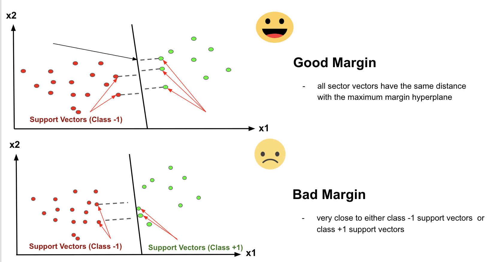

# NimbusAI - Mchine learning powered ai model

this uses SVC(support vector classifier) that is ,  the hyperplane classifies the dataset linearly

# Example


# Deployment

install all required libraries with pip

```pip install -r requirements.txt```

Run `brain.py` file and it will generate `responses.pkl` , `nimbus.pkl` , `vectorizer.pkl` make sure to train it with your dsta in `brain.py` you can even edit this code to make it train on a different file 

You can use `model-test.py` to test your model through cmd line , after which run `telegram_bot.py` including bot's token you can get token from [Bot Father](https://telegram.me/BotFather/)
making your bot go on the internet through telegram 

## More platforms support and better model will be coming in future updates


